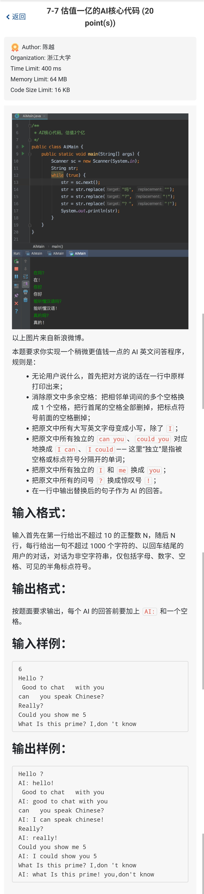

# 从 字符串小技巧 到 一道有意思的题

起因是这样的: 6点左右~~正要睡觉的, 没错, 睡觉~~ 我看到高中同学发来的题, ~~垂死病中惊坐起~~, 心想, 这么有意思的题一定要做一做!! ~~结果还是没做成, 题目描述有问题~~.

## 字符串的小技巧---减少一次拷贝

之前说过, 所谓的字符串就是一种按照一定规则读取的字符指针.

对于如下的代码:

```cpp
char data[100] = "abcde";
char *p = data+1;
```

内存中的数据是这样的:

|data+0|data+1|data+2|data+3|data+4|data+5|
|-|-|-|-|-|-|
|'a'|'b'|'c'|'d'|'e'|'\0'|

那么, `data` 是 `"abcde"`. `p` 是 `"bcde"`. `p+1` 是 `"cde"`.

很多时候, 当我们需要去掉字符串开头或者末尾的字符时, 可以简单地修改指针. 比如, 对于上面的代码, `*p` 就是去掉data的第一个字符的字符串. **注意, 不要轻易修改这样的字符串的值.** 这样子做可以省去一次拷贝字符串的时间 ~~以及代码量~~.

还有一点, C语言中, **在任何情况下** `*(p+i)` 与 `p[i]` 完全等价, 无论`p`是数组还是指针. 因此, 在使用`*(p+i)`的时候均可简写为`p[i]`. ~~少按两次键盘~~.

在C++中, C++17以前二者无任何区别, C++17以后二者的"求值顺序"不同, 也就是说对于 `*(++p + ++i)` 与 `++p[++i]`, 二者的区别在于i和p的自增顺序不同. 因此, 在C++语言中, 我们遇到的绝大部分情况里后者均可代替前者.

# 一道有意思的题



注: 个人认为样例有问题. 题目要求 **"原句中could you"替换为"I could", 但是样例是将原句中的Could you也替换为了I could.** 根据样例可知, 题目的意思是 **逐个按照不同规则替换,** 意味着经过某规则替换后的结果满足另一个规则仍然替换, 但是题目描述中是替换原句, 也就是**同时按照多个规则替换**. 以下代码按照第二种理解方式.

```cpp
#include <stdio.h>
#include <string.h>

int is_symbol(char *p){
    return *p == '[' || *p == '{' || *p == ']' || *p == '}' || *p == '\\' || *p == '|' || *p == ';' || *p == ':' || *p == '\'' || *p == '\"' || *p == ',' || *p == '<' || *p == '.' || *p == '>' || *p == '/' || *p == '?';
}

int is_symbol_space(char * p){
    return *p == ' ' || *p == '[' || *p == '{' || *p == ']' || *p == '}' || *p == '\\' || *p == '|' || *p == ';' || *p == ':' || *p == '\'' || *p == '\"' || *p == ',' || *p == '<' || *p == '.' || *p == '>' || *p == '/' || *p == '?';
}


int startWith(char* a, char* b){
    int i = 0;
    if(strlen(a) < strlen(b)){
        return 0;
    }
    if(is_symbol_space(a-1) && is_symbol_space(a+strlen(b))){
        for(i = 0; i < strlen(b); ++ i){
            if(a[i] != b[i]){
                return 0;
            }
        }
    }else{
        return 0;
    }
    return 1;
}

void solve(){
    char data[1000] = {0};
    char output[1000] = {0};
    char *p = data;
    int i = 0;
    int size = 0;
    int oi = 0;
    gets(data+1); // 空出一格
    for(i = 1; i < strlen(data+1); ++ i){
        if(data[i] != ' ') break;
    }
    p = data+i;
    for(i = strlen(data)-1; i >= 0; -- i){
        if(data[i] != ' ') break;
    }
    data[i+1] = '\0';
    size = strlen(p);
    printf("%s\n",p);

    *(p-1) = '.'; // 前面补个标点
    p[size] = '.'; // 后面补个标点
    // 补标点是为了判断"独立的"字符的时候判断方便, 同时也可以在后面安全的使用p[i+1], 不会造成越界.
    for(i = 0; i < size; ++ i){
        if('A' <= p[i] && p[i] <= 'Z' && p[i] != 'I'){
            p[i] = p[i] + 'a' - 'A';
        }
    }
    for(i = 0; i < size;){
        // 可以安全的使用p[i+1]
        if(p[i] == ' ' && p[i+1] == ' '){
            i++;
            continue;
        }
        if(startWith(p+i,"can you")){
            output[oi++] = 'I';
            output[oi++] = ' ';
            output[oi++] = 'c';
            output[oi++] = 'a';
            output[oi++] = 'n';
            i = i + 7;
            continue;
        }
        if(startWith(p+i, "could you")){
            output[oi++] = 'I';
            output[oi++] = ' ';
            output[oi++] = 'c';
            output[oi++] = 'o';
            output[oi++] = 'u';
            output[oi++] = 'l';
            output[oi++] = 'd';
            i = i + 9;
            continue;
        }
        if(p[i] == ' ' && is_symbol(p+i+1)){
            i++;
            continue;
        }
        if(startWith(p+i,"I")){
            output[oi++] = 'y';
            output[oi++] = 'o';
            output[oi++] = 'u';
            i = i + 1;
            continue;
        }
        if(startWith(p+i,"me")){
            output[oi++] = 'y';
            output[oi++] = 'o';
            output[oi++] = 'u';
            i = i + 2;
            continue;
        }
        if(p[i] == '?'){
            output[oi++] = '!';
            i++;
            continue;
        }
        output[oi++] = p[i++];
    }
    output[oi] = '\0';
    printf("AI: %s\n", output);
}

int main(){
    int n = 0;
    scanf("%d",&n);
    getchar();
    while(n--){
        solve();
    }
    return 0;
}
```