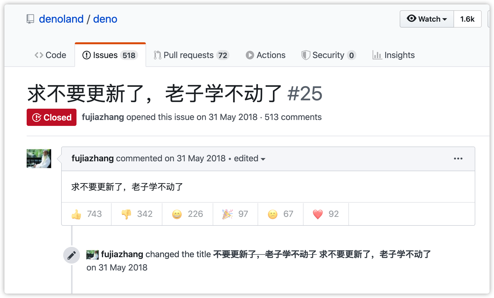
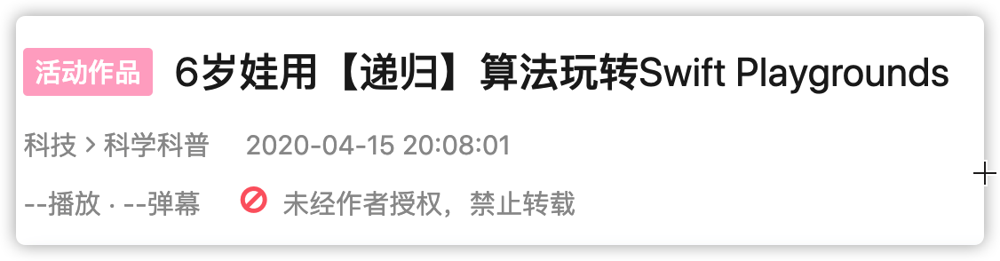
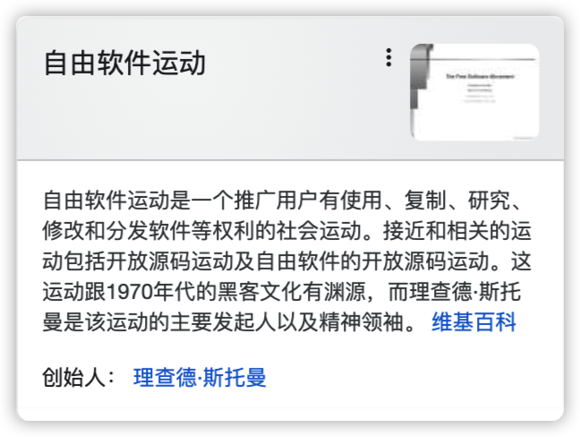

# 码浪 - 新一代程序员献给自己的演讲.

那些口口声声，新技术太多学不动的人，应该看着咱们。

我们看着自己，满怀欣喜，程序员积攒了几十年的财富，所有的代码、论文、文档和教程，像是专门为咱们准备的礼物。 文档齐全、社区友好、生态成熟，计算机科学的成果被层层打开，可以尽情地享用。自由学习一门语言，学习一种技术，欣赏一段代码，去遥远的地方进修。 我们从小就能自由探索自己的兴趣，不在需要对着小霸王敲一行一行重启就消失了的BASIC，可以使用scratch进行图形化编程，甚至很多人在幼儿园使用swift playground就进入了不惑之年，不惑于递归是什么，回溯又是什么。人与人之间的壁垒被打破，我们只凭使用相同的库就能结交千万个一起讨论的朋友。我们有幸遇见这样的时代，但是时代更有幸遇见这样的我们。

我们看着自己，满怀敬意，向我们的开源精神致敬，我们正在把别人的变成自己的，把自己的变成别人的，把学术的变成大众的，把个人的变成世界的。随着保护开源者的协议的出现，我们的权益得到了保证。随着自由软件运动的不断推广，用户有了使用，复制，研究，修改和分发软件的权利。我们可以自由的参与、学习别人的项目，可以自由的修改我们所使用的程序来获得自己想要的功能。

任何人的想象力不足以想象我们的未来。奔涌吧，码浪！我们在同一条奔涌的河流。
